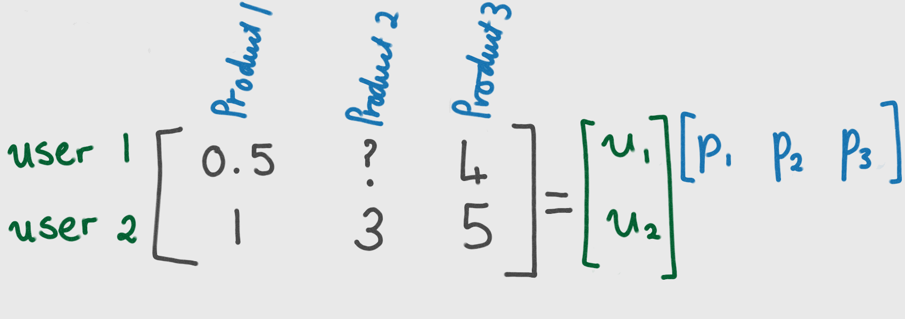

# A gentle introduction to Alternating Least Squares

A successful recommendation engine is one which provides accurate and personalised predictions to users in a timely manner. Such systems are of increasing commercial importance. Collaborative Filtering algorithms allow us to give predictions by capturing the commonality between users.s

In this post I'll give you a gentle introduction to one such collaborative filtering algorithm - Alternating Least Squares, or ALS for short. Through a gentle example you will get a feel for what alternating least squares is doing. _Disclaimer: We are going to do a simplified ALS to give you a feeling for what is going on, rather than pushing you into a deep, deep pool of mathematics and greek letters._

Consider the following matrix which holds opinions of two users on three products:

 We wish to be able to predict how user 1 will rate product two. This is where Alternating Least Squares comes in.

The goal of Alternating Least Squares is to find two matrices, U and P, such that their product is approximately equal to the original matrix of users and products. Once such matrices have been found, we are able to predict what user i will think of product j by multiplying row i of U with row j of P.

## Computing U and P through ALS.

The method is called "alternating" since the following two steps are repeated:
1. fix matrix U and find the optimal matrix P
2. fix matrix P and find the optimal matrix U

The 'least squares' bit of ALS comes into play when we find the 'optimal' matrices, because 'optimal' in this case is taken to mean "minimises least squares error" (plus some regularisation term which prevents overfitting).

Let's run through the first couple of steps by hand. For simplicity, I'm ignoring the term which prevents overfitting. I'm also making the choice that the number of features U and P is one. This corresponds to the number of columns in U, and rows in P. (In practise for a non-trivial example you will likely want a larger number of features. We will look at tuning for the optimal number of features in a future post.)

So our aim is to find matrices U and P such that:

We start by fixing matrix U. I could have picked any values for U, but I chose 1's to make the maths easier.

If we multiply this out, we get 5 equations which involve the components of P:

There is a lone equation which governs the second component of P, thus we set that equal to 3. We need to select the remaining two components such that the mean squared error is minimised. Thus we compute:

and

From this, we get our first estimate of P:

Now we keep P fixed and optimise for matrix U. This similarly gives us the following equations for U:

We can then minimise mean squared error to solve for the components of U, as we did for P in equations (6) and (7).

Repeating this process we will, at some point, converge upon the optimal matrices U and P. In this example, after 20 iterations we find that U and P are given by:

Thus we are now able to predict what user 1 thinks of product 2. By multiplying the first component of U by the second component of P we reach an estimate of 1.897.

# Disclaimers:
1. I ignored the regularisation term. In practise, you always want to prevent overfitting when you are fitting a model to data.
2. This is a very simple example. Usually, for non trivial ratings matrices the minimisation is tricky.
3. This decomposition of the original matrix into matrices U and P is not exact - when you multiply U and P together you will not recover the exact ratings matrix. This needs to be taken into account when designing applications. (Don't worry - we'll talk about that another day.)
